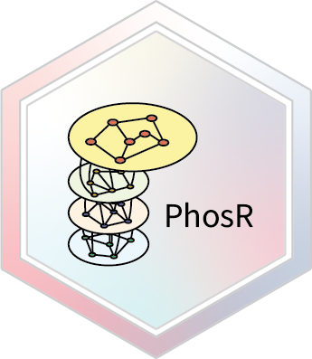

<!-- badges: start -->
[](https://github.com/PYangLab/PhosR/actions)
<!-- badges: end -->


# PhosR

`PhosR` is a package for the comprenhensive analysis of phosphoproteomic data. There are two major components to PhosR: processing and downstream analysis. PhosR consists of various processing tools for phosphoproteomic data including filtering, imputation, normalisaton and batch correction, which enables integration of multiple phosphoproteomic datasets. Downstream analytical tools consists of site- and protein-centric pathway analysis to evaluate activities of kinases and signalling pathways, large-scale kinase-substrate annotation from dynamic phosphoproteomic profiling, and visualisation and construction of signalomes present in the phosphoproteomic data of interest.

## PhosR overview


## Installation

Install the development version from GitHub using the `devtools` package:

```r
library(devtools)
devtools::install_github("PYangLab/PhosR")
```

## Vignette 

<!--You can find the vignette at our website: https://PYangLab.github.io/PhosR/articles/PhosR.html-->
Please note that the vignette generated in the link below is using the full dataset. 
Our vignette prepared for BioC (`PhosR.Rmd`) utilises the subset of these datasets and the results may not be identical.

* Introduction
     * [Full vignette](https://pyanglab.github.io/PhosR/articles/PhosR.html)
* Processing of phosphoproteomic data 
     * [Imputation](https://pyanglab.github.io/PhosR/articles/imputation.html)
     * [Batch correction](https://pyanglab.github.io/PhosR/articles/batch_correction.html)
* Downstream analysis of phosphoproteomic data
     * [Pathway analysis](https://pyanglab.github.io/PhosR/articles/pathway_analysis.html)
     * [Site- and gene-centric analysis](https://pyanglab.github.io/PhosR/articles/site_gene_analysis.html)
     * [Kinase-substrate relationship scoring and signalome construction](https://pyanglab.github.io/PhosR/articles/signalomes.html)

## Contact us

If you have any enquiries, especially about performing PhosR to analyse your phosphoproteomic data, please contact taiyun.kim@sydney.edu.au or hani.kim@sydney.edu.au. We are also happy to receive any suggestions and comments.
