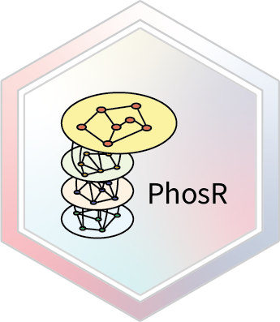

<!-- badges: start -->
[](https://github.com/PYangLab/PhosR/actions)
<!-- badges: end -->


# PhosR

`PhosR` is a Bioconductor package for the comprehensive analysis of phosphoproteomic data. There are two major components to PhosR: processing and downstream analysis. PhosR provides tools for filtering, imputation, normalisation and batch correction, enabling integration of multiple phosphoproteomic datasets. Downstream analytical tools support site- and protein-centric pathway analysis, inference of kinase and signalling pathway activities, large-scale kinase-substrate annotation from dynamic phosphoproteomic profiling, and visualisation and construction of signalomes.

The method was published in Cell Reports (https://doi.org/10.1016/j.celrep.2021.108771), with a step-by-step STAR Protocol (https://doi.org/10.1016/j.xpro.2021.100585).

## PhosR overview


## Installation

Install the formal Bioconductor release:

```r
if (!requireNamespace("BiocManager", quietly = TRUE))
    install.packages("BiocManager")

BiocManager::install("PhosR")
```

Install the development version from GitHub:

```r
devtools::install_github("PYangLab/PhosR")
```

## Vignette 

<!--You can find the vignette at our website: https://PYangLab.github.io/PhosR/articles/PhosR.html-->
Please find the links to our vignette below. The vignette uses subsets of the phosphoproteomic datasets from the published Cell Reports study, so results are intended for demonstration and will not be identical to full-study analyses.

* Introduction
     * [Full vignette](https://pyanglab.github.io/PhosR/articles/PhosR.html)
* Processing of phosphoproteomic data 
     * [Imputation](https://PYangLab.github.io/PhosR/articles/web/imputation.html)
     * [Batch correction](https://PYangLab.github.io/PhosR/articles/web/batch_correction.html)
* Downstream analysis of phosphoproteomic data
     * [Pathway analysis](https://PYangLab.github.io/PhosR/articles/web/pathway_analysis.html)
     * [Site- and gene-centric analysis](https://PYangLab.github.io/PhosR/articles/web/site_gene_analysis.html)
     * [Kinase-substrate relationship scoring and signalome construction](https://PYangLab.github.io/PhosR/articles/web/signalomes.html)

## Citation

If you use PhosR, please cite the method paper:

1. Kim, H.J., Kim, T., Hoffman, N.J., Xiao, D., James, D.E., Humphrey, S.J. & Yang, P. (2021) PhosR enables processing and functional analysis of phosphoproteomic data. Cell Reports, 34(8), 108771. https://doi.org/10.1016/j.celrep.2021.108771

For step-by-step use of PhosR, please also cite the STAR Protocol:

2. Kim, H.J., Kim, T., Xiao, D. & Yang, P. (2021) Protocol for the processing and downstream analysis of phosphoproteomic data with PhosR. STAR Protocols, 2(2), 100585. https://doi.org/10.1016/j.xpro.2021.100585

From R, run `citation("PhosR")` for the package citation metadata.

## Contact us

If you have any enquiries, especially about performing PhosR to analyse your phosphoproteomic data, please contact dxiao@cmri.org.au or hani.kim@garvan.org.au or pengyi.yang@sydney.edu.au. We are also happy to receive any suggestions and comments.
